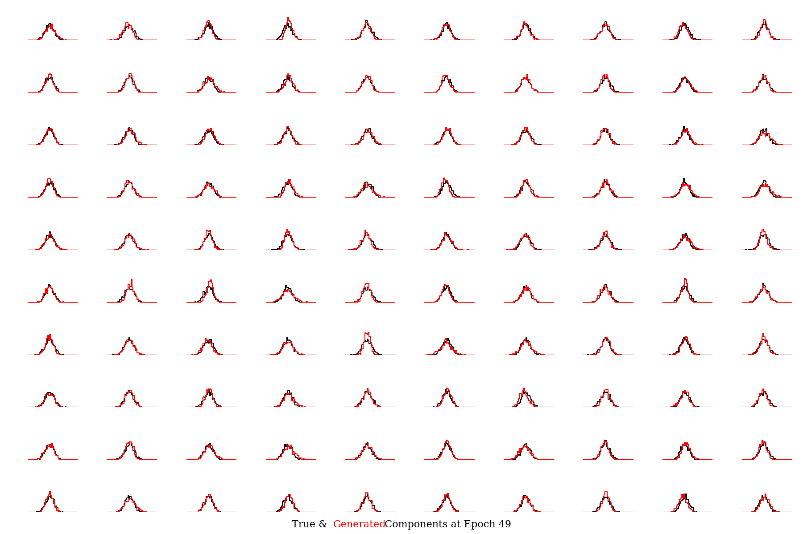

# gaussGAN - Exploring the limitations of GANs

Experiments on limitations of simulating Gaussian data with GANs


## Requirements

The package as well as the necessary requirements can be installed by running `make` or via
```
virtualenv -p /usr/local/bin/python3 venv
source venv/bin/activate
python setup.py install
```

## Generate Data

To generate some n-dimensional data, use the `gen-samples.py` script:
```
python gen-samples.py -n 1000 -s gauss -b 10 -d 1 2 10
```

where `-n` gives the samples per batch, `-s` specifies the parent distribution (options: gauss, trunc_gauss, cauchy, uniform),
`-b` is the number of batches to run and `-d` is a list to specify the dimensions n of multi-dimensional datasets to generate.

This will create a directory `datasets` with the saved generated data named according to the dimensionality,
along with figures displaing the Euclidean norm distribution of the datasets:
```
datasets/
│   data_gauss_dim1.h5
│   data_gauss_dim2.h5
│   data_gauss_dim10.h5
│   hist_gauss_dim1.png
│   hist_gauss_dim2.png
│   hist_gauss_dim10.png
```

The histograms saved in the datasets directory show the distributions of the parent population's Euclidean norm.
Below are shown shown some examples.

<p float="left">
  
  
  
</p>


## Train a Generator

To train the generator on a specific n-dimensional dataset, use
```
python train.py -f datasets/data_gauss_dim10.h5 -d 100 -s 0.1 -n 100
```
where `-f` specifies the parent distribution dataset to mode, `-d` defines the dimensions of the Gaussian latent space variable,
`-s` is the width of the Gaussian latent space for all elements, and `-n` is the number of epochs over which to train.
The option to use a Wasserstein + gradient penalty update rule is provided by the `-w` flag, with the Vanilla GAN being the default method.

This will save results from the training in the following directory structure:
```
runs/
│
└───gauss_dim10_100_0.01_van/
    │    test_corr.png
    │    training_details.csv
    │    training_model_losses.png
    │    training_pvalues.png
    └────models/
         │    generator.pth.tar
         │    discriminator.pth.tar
    └────samples/
         │    comp_hist_epoch00000.png
         │        ...
         │    comp_hist_epoch00049.png
         │    corr_epoch00000.png
         │        ...
         │    corr_epoch00040.png
         │    ks_epoch00000.png
         │        ...
         │    ks_epoch00049.png
         │    rhist_epoch00000.png
         │        ...
         │    rhist_epoch00049.png
```

Some example figures from training a GAN on a 100-dimensional Gaussian dataset with a 100-dimensional latent space vector having 0.01 sigma are shown below.
These show results after having trained for 50 epochs.


True (black) compared to generated (red) samples
<p float="left">
  
</p>

Correlation matrix of 1000 samples from generator. The cross-correlations for a same-sized sample from the parent distribution is shown in red. 
<p float="left">
  
</p>

Euclidean norm distribution (left) for parent and generated samples, and the KS-test results comparing a batch of samples for each vector component (right).
<p float="left">
  
  
</p>
